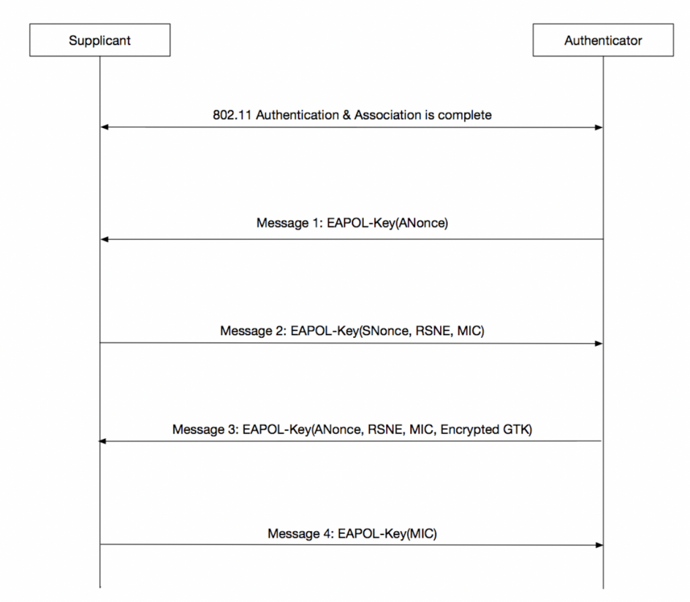

<!-- omit in toc -->
# WPA & WPA2

<!-- omit in toc -->
## Table of Contents

1. [Fundamentals](#fundamentals)
	1. [Improvements Over WEP](#improvements-over-wep)
	2. [Handshake](#handshake)
2. [Capture](#capture)
	1. [Network Card Configuration](#network-card-configuration)
	2. [Monitor Mode](#monitor-mode)
	3. [MAC Address](#mac-address)
	4. [Standalone Capture](#standalone-capture)
	5. [Capture Filters](#capture-filters)
	6. [Export Packet Captures](#export-packet-captures)
	7. [Treat and Clean Packet Captures](#treat-and-clean-packet-captures)

## Fundamentals

### Improvements Over WEP

This protocol was created after the multiple flaws that made WEP protocol vulnerable.

The Temporal Key Integrity Protocol (TKIP) was created with the WPA protocol. TKIP employs a per-packet encryption key that is dynamically generated. In the WEP protocol this is done with a master key that does not change between each packet and that can not be changed. TKIP prevents the attack vectors used in the WEP protocol, that consisted in the accumulation of multiple packages to guess the WiFi password statistically.

In addition, the WPA protocol includes a Message Integrity Check, that was designed to prevent an attacker to alter or resend data packets. This replaced the Cyclic Redundancy Check (CRC) that was used in the WEP standard, as it was vulnerable.

Unfortunately, WPA uses the same RC4 encryption algorithm used in WEP. This encryption algorithm was already broken in the WEP protocol, so the vulnerabilities in WPA started appearing quickly.

To remediate this WPA2 protocol was created. This protocol uses the AES encryption algorithm instead of RC4. This improves considerably the security. For the per-packet encryption, TKIP is replaced to CCMP (Counter Mode Cipher Block Chaining Message Authentication Code Protocol).

To summarize, a brief comparison between protocols:


### Handshake

The only packets that contain useful information and can be used to crack the password in WPA/WPA2 are the handshake packets. This packets are used in a process called the Four-Way Handshake. This process includes the first four messages of the encryption connection process between the client and the AP (Access Point). This sequence of packets can be captured and used to extract the password of the AP. Thus, it is very interesting for an attacker to capture this packets. A common way to refer to this set of packages is EAPOL.

The complete sequence is described below:



It is important to emphasize that this sequence of packets is exchanged between the client and the AP in every reconnection. That is why deauthentication attacks are made to force the reconnection from the clients and the subsequent capture of the EAPOL.

From this captured EAPOL, the hash of the encrypted password of the AP can be extracted and then cracked like you would do with a conventional hash.

## Capture

### Network Card Configuration

First, we have to configure some aspects of our network card in order to capture the packets in the air. To list the configuration of the network card (Being wlan0 your WiFi network adapters name	):

```bash
ifconfig wlan0
```

We will see something like this:

```bash
wlan0: flags=8863<UP,BROADCAST,SMART,RUNNING,SIMPLEX,MULTICAST> mtu 1500
	options=6463<RXCSUM,TXCSUM,TSO4,TSO6,CHANNEL_IO,PARTIAL_CSUM,ZEROINVERT_CSUM>
	ether f4:d4:88:81:2e:5a
	inet6 fe80::148b:719e:2d65:2eb0%en0 prefixlen 64 secured scopeid 0xe
	inet 192.168.0.45 netmask 0xffffff00 broadcast 192.168.0.255
	nd6 options=201<PERFORMNUD,DAD>
	media: autoselect
	status: active
```

We can see some useful information here. Starting with "UP" that indicates that our interface is operative. We can additionally see the MTU (Maximum Transmission Unit) or the IPv4 and IPv6 networks that are being used by the interface.

To enable a network interface:

```bash
ifconfig wlan0 up
```

To disable it:

```bash
ifconfig wlan0 down
```

To assign an IP, Netmask and Broadcast to a network interface:

```bash
ifconfig wlan0 192.168.0.0 netmask 255.255.255.0 broadcast 192.168.0.1
```

### Monitor Mode

In order to capture the packets that are in the air, we have to enable an special operation mode in our network adapter. It is important to say that not all network adapters support this mode, so we will need to select a hardware device that supports this mode, called monitor mode.

Once we have our network adapter connected to our system and enabled to be used, we have to enable the monitor mode. To do this, we will use the following commands:

```bash
airmon-ng check kill
```

```bash
airmong-ng start wlan0
```

The first command will kill all the interfering processes and the second one will activate the monitor mode as such.

It is important to emphasize that while the adapter is in monitor mode, we will loss the connection to the Internet.

To verify if the monitor mode has been enabled in the network adapter we will list the configuration of all the network adapters with:

```bash
ifconfig
```

We have to see an adapter with a name like "wlan0mon".

Lastly, if we want to disable the monitor mode we can use the following command:

```bash
airmong-ng stop wlan0mon && service network-manager restart
```

This command will disable the monitor mode as such and then it will restart the network-manager (Process used to manage the network connections in our device).

### MAC Address

It is important to stay as undetectable as possible while capturing and sending network packages, as we always leave a trace, the MAC address. This address is used to uniquely identify every network adapter in the word. This address consists in 6 bytes. The first 3 bytes are called OUI (Organizationally Unique Identifier) and identify the organization behind the adapter. The last 3 bytes identify each unique adapter. We can see this in the following image:


This address can be changed with a tool called **MacChanger**.

First, we have to disable our network adapter in order to change the MAC address:

```bash
ifconfig wlan0mon down
```

Then, we can list all the different OUIs with the following command:

```bash
macchanger -l
```

Once we select the OUI we want to use, we can use the following command to change our MAC address to a custom one:

```bash
macchanger -m aa:aa:aa:aa:aa:aa wlan0mon
```

If what we want is to have a randomly assigned MAC address we can use the following command:

```bash
macchanger -r wlan0mon
```

In order for the changes to take effect, we will have to enable the network adapter:

```bash
ifconfig wlan0mon up
```

Additionally, we can see our assigned MAC address and our permanent MAC address (**MacChanger** will always store our original MAC address) with the following command:

```bash
macchanger -s wlan0mon
```

We will see something like this:

```bash
Current MAC:   00:20:91:da:1b:6a (J125, NATIONAL SECURITY AGENCY)
Permanent MAC: e4:70:b8:d3:93:5c (unknown)
```

Lastly, if we want to revert the changes and recover our permanent MAC address we will use the following commands:

```bash
ifconfig wlan0mon down
macchanger -p wlan0mon
ifconfig wlan0mon up
```

### Standalone Capture

At first glance, we can capture all the traffic from all the available networks. To do this:

```bash
airodump-ng wlan0mon
```

### Capture Filters

### Export Packet Captures

### Treat and Clean Packet Captures